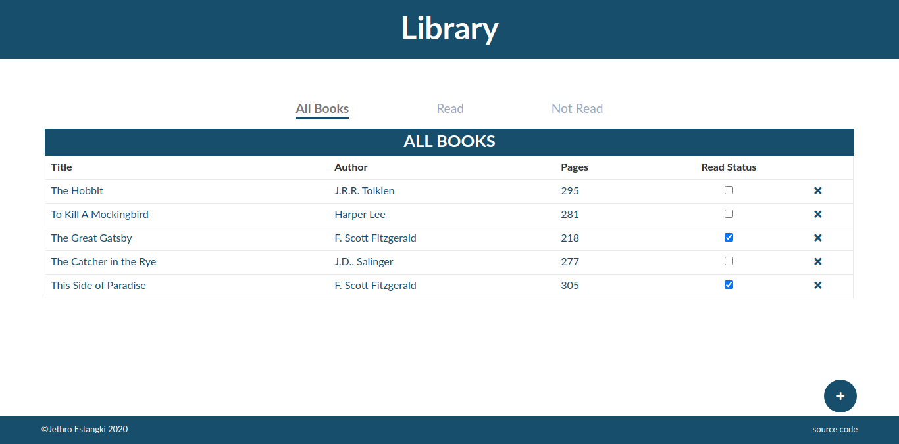

# library
An online library using local storage for storing data. 
From [The Odin Project's](https://www.theodinproject.com/) [curriculum](https://www.theodinproject.com/courses/javascript/lessons/library) 

## To-do
* Add local storage
* Add sorting function
